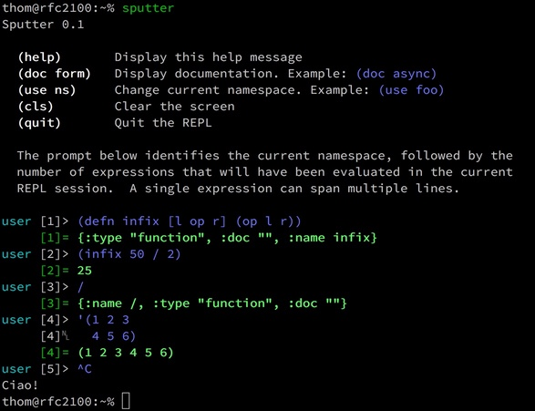

# Sputter (a Lisp Interpreter)
Sputter is a simple Lisp Interpreter written in
[Go](https://golang.org/). Basically, it's just me having some fun
and trying to improve my Go skills. That means you're unlikely to
find something you'd want to use in production here. On the other
hand, if you want to join in on the fun, you're more than welcome
to.

## How To Install
Make sure your `GOPATH` is set, then run `go get` to retrieve the
package.

```bash
go get github.com/kode4food/sputter
```

## How To Invoke The Interpreter
Once you've installed the package, you can run it from `GOPATH/bin`
like so:

```bash
sputter somefile.lisp

# or

cat somefile.lisp | sputter
```

## How To Invoke The REPL
Sputter has a very crude Read-Eval-Print Loop that will be more than
happy to start if you call it with no arguments from the terminal:



## Current Status
I just started this thing and it's still pretty fragile, but
that will change rapidly. The current built-in forms are:

  * Control and Branching: `if`, `cond`, `quote`, `do`
  * Numeric: `+`, `-`, `*`, `/`, `!=`, `=`, `<`, `<=`, `>`, `>=`
  * Variables: `def`, `let`, `ns`, `with-ns`
  * Functions: `defn`, `fn`, `apply`
  * Predicates: `eq`, `!eq`, `nil?`, `!nil?`
  * Sequences: `cons`, `conj`, `first`, `rest`, `seq?`, `!seq?`
  * Lists: `list`, `list?`, `!list?`, `to-list`
  * Vectors: `vector`, `vector?`, `!vector?`, `to-vector`
  * Associative Arrays: `assoc`, `assoc?`, `!assoc?`, `to-assoc`
  * Indexed Sequences: `nth`, `indexed?`, `!indexed?`
  * Mapped Sequences: `mapped?`, `!mapped?`
  * Comprehensions: `concat`, `map`, `filter`, `reduce`, `take`, `drop`
  * Metadata: `meta`, `with-meta`
  * Concurrency: `channel`, `async`, `promise`, `future`
  * Strings: `str`, `split`
  * I/O: `print`, `println`, `pr`, `prn`

Documentation for most of these forms may be viewed in the
REPL using the `doc` function.

## License (MIT License)
Copyright (c) 2017 Thomas S. Bradford

Permission is hereby granted, free of charge, to any person
obtaining a copy of this software and associated documentation
files (the "Software"), to deal in the Software without
restriction, including without limitation the rights to use,
copy, modify, merge, publish, distribute, sublicense, and/or
sell copies of the Software, and to permit persons to whom the
Software is furnished to do so, subject to the following
conditions:

The above copyright notice and this permission notice shall be
included in all copies or substantial portions of the Software.

THE SOFTWARE IS PROVIDED "AS IS", WITHOUT WARRANTY OF ANY KIND,
EXPRESS OR IMPLIED, INCLUDING BUT NOT LIMITED TO THE WARRANTIES
OF MERCHANTABILITY, FITNESS FOR A PARTICULAR PURPOSE AND
NONINFRINGEMENT. IN NO EVENT SHALL THE AUTHORS OR COPYRIGHT
HOLDERS BE LIABLE FOR ANY CLAIM, DAMAGES OR OTHER LIABILITY,
WHETHER IN AN ACTION OF CONTRACT, TORT OR OTHERWISE, ARISING
FROM, OUT OF OR IN CONNECTION WITH THE SOFTWARE OR THE USE OR
OTHER DEALINGS IN THE SOFTWARE.
